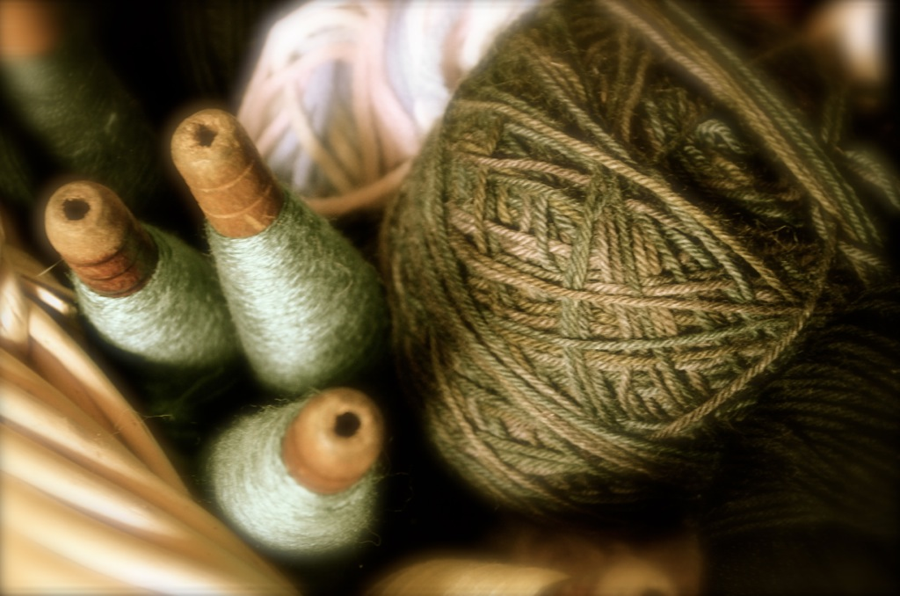
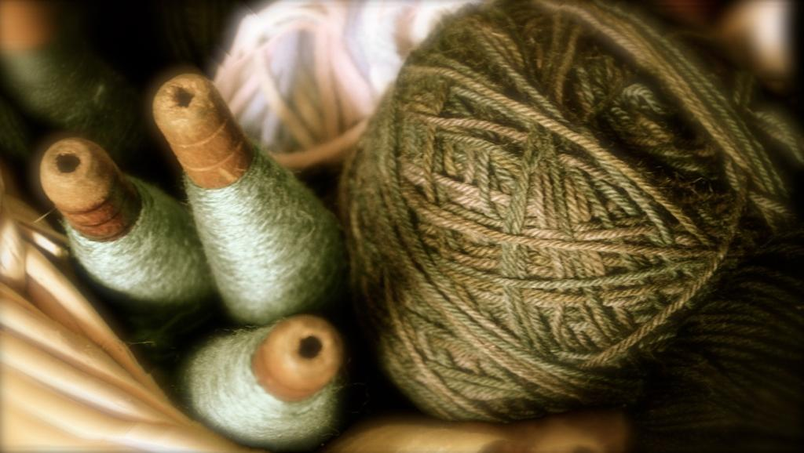
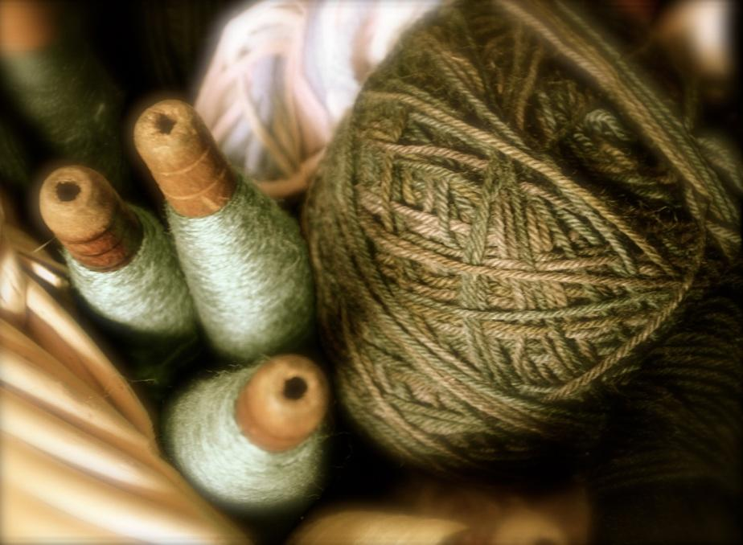

Content Aware Image Resize in Scala
===================================

Based on work from a Coursera algorithms class take, this code
demonstrates how to resize images vertically or horizontally while
preserving the most significant content in the image and maintaining
the aspect ratio of the image.

Examples
--------

Original image (1024x678):

100 pixels removed vertically (1024x578):

100 pixels removed horizontally (924x678):

License
-------

Copyright 2013 Jim Guistwite

Licensed under the Apache License, Version 2.0 (the "License");
you may not use this file except in compliance with the License.
You may obtain a copy of the License at http://www.apache.org/licenses/LICENSE-2.0

Unless required by applicable law or agreed to in writing, software
distributed under the License is distributed on an "AS IS" BASIS,
WITHOUT WARRANTIES OR CONDITIONS OF ANY KIND, either express or implied.
See the License for the specific language governing permissions and
limitations under the License.
